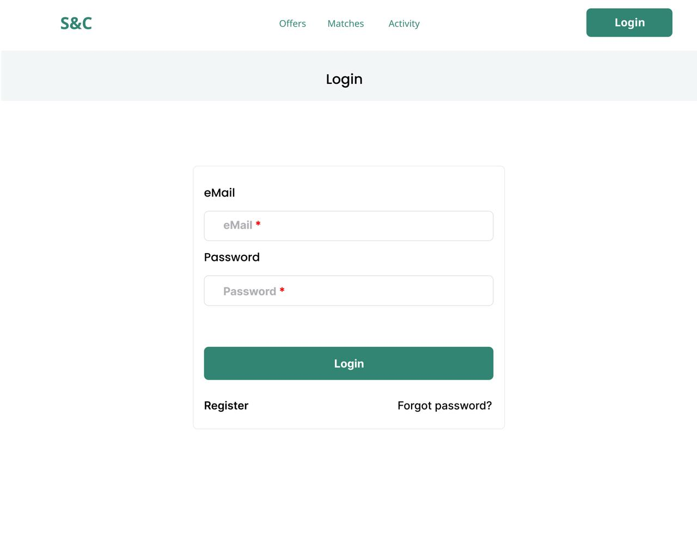

# Software Engineering 2 Project RASD,DD and I&T

## Authors
- **Palladino Vittorio**
- **Vaccarino Giovanni**
- **Vacis Nicolò**

## Introduction

For this project, we were tasked with developing a job boarding platform called **S&C**. The platform is designed to facilitate internship postings and applications, providing an intuitive interface for both companies and students. Our solution integrates a backend built with ASP.NET Core and a frontend developed using React with TypeScript.

Below are two example of the platform in action:

### Login Page



---

### Home Page


---

## Installation Instructions
Following the instructions for setting up and running the platform locally, including both the backend (written in ASP.NET Core) and the frontend (developed in React with TypeScript). Follow these steps carefully to ensure proper configuration and execution.

### Prerequisites

Before proceeding with the installation, ensure that the following prerequisites are met:

### Backend Requirements:
- .NET SDK (version 8.0 or later)
- A code editor (e.g., Rider or Visual Studio Code)

### Frontend Requirements:
- Node.js (version 18.x or later) and npm (version 9.x or later)
- A code editor (e.g., Visual Studio Code)

## Setting Up

1. Copy the folder in the zip file named `VaccarinoPalladinoVacis` wherever you prefer on your device.

### Setting Up the Backend

The backend is implemented as an ASP.NET Core application. Follow these steps to set it up:

1. Navigate to the backend folder (assuming you're in the `VaccarinoPalladinoVacis` folder):
   ```sh
   cd SC/backend
   ```
2. **Configure the environment variables.**
   
   In the zip file, you can find a directory called `env-files` that contains all the necessary files to copy. In particular, for the backend, copy:
   - `appsettings.json` into the root of the backend project directory.
   - `appsettings.Development.json` into the root of the backend project directory.
   - `launchSettings.json` into a directory named `Properties` inside the root of the backend project directory.

3. Restore dependencies:
   ```sh
   dotnet restore
   ```
4. Run the application locally:
   ```sh
   dotnet run
   ```
   The backend will typically run on `https://localhost/api:5000` by default. **Ensure the port is 5000.**

### Setting Up the Frontend

The frontend is a React application written in TypeScript. Follow these steps to set it up:

1. Navigate to the frontend folder (assuming you're in the `VaccarinoPalladinoVacis` folder):
   ```sh
   cd SC/frontend
   ```
2. Install dependencies:
   ```sh
   npm install
   ```
3. Run the application locally:
   ```sh
   npm run dev
   ```
   The frontend will typically be available at `http://localhost:5173`. **Ensure the running port is 5173 to avoid CORS policy issues.**

## Running the Platform Locally

Once both the backend and frontend are set up, follow these steps to run the entire platform:

1. Start the backend (if not already started) by running `dotnet run`.
2. Start the frontend (if not already started) by running `npm run dev`.
3. Open a browser and navigate to `http://localhost:5173` to access the platform.

## Troubleshooting

- **Frontend API errors:** Ensure the running ports are correct (5000 for backend and 5173 for frontend).
- **Dependency installation issues:** Make sure the correct versions of .NET SDK, Node.js, and npm are installed.

## Running the tests
1. Navigate to the BackendSolution folder (assuming you're in the `VaccarinoPalladinoVacis` folder):
   ```sh
   cd SC/BackendSolution
   ```

2. Run the tests(before executing it, **ensure** that there are not any active executions of the backend 
   ```sh
   dotnet test
   ```

## Mail-Related Features
All features related to mail sending, such as password recovery or email verification, require authorization through AWS SES (Simple Email Service). Since we are using SES in sandbox mode, these features are currently unavailable unless the email address is authorized. Due to this limitation, we have not restricted access for users who have not been verified.
